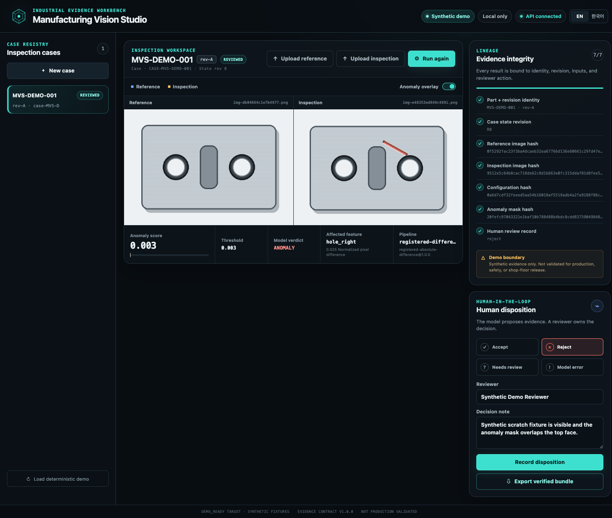
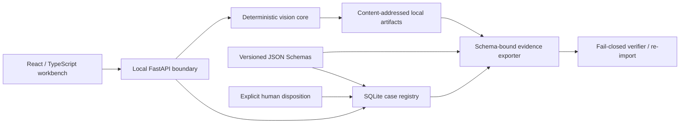

# Manufacturing Vision Studio

Local-first industrial visual-inspection workbench that binds deterministic
image anomaly evidence to a part, CAD revision, engineering feature, and an
explicit human disposition.

> **Synthetic demo only.** This project is not validated for production,
> safety, metrology, or shop-floor release decisions.

## Why this project is different

Most anomaly demos stop at a heatmap. Manufacturing Vision Studio preserves the
full evidence chain:

```text
image → anomaly mask → engineering feature → CAD revision
      → human disposition → verified evidence bundle
```

The checked-in journey uses deterministic synthetic fixtures and runs entirely
on the local machine. No account, credential, private dataset, or cloud service
is required.



## Bounded v0.1 journey

1. Create or open an inspection case for a declared part and CAD revision.
2. Import a normal reference and one or more inspection images.
3. Run the versioned registration and image-difference baseline.
4. Review the image score, binary anomaly mask, and feature mapping.
5. Record `accept`, `reject`, `needs_review`, or `model_error`.
6. Export a deterministic ZIP evidence package.
7. Re-import and independently verify every identity and SHA-256 binding.

Part and revision identity are declared engineering inputs. The software never
guesses them from image appearance, and a model result never releases a
physical part.

## Local setup

Prerequisites:

- Python 3.11 or newer
- [uv](https://docs.astral.sh/uv/)
- Node.js 20 or newer with npm

Install locked Python and web dependencies plus the Chromium test runtime:

```bash
make setup
```

Start both local services with one command:

```bash
make demo
```

Then open `http://127.0.0.1:4173`. Press `Ctrl-C` once to stop both services.

For separate development terminals, run the services directly:

Run the API:

```bash
uv run uvicorn manufacturing_vision_studio.api:create_app \
  --factory --host 127.0.0.1 --port 8000
```

In a second terminal, run the web application:

```bash
npm --prefix web run dev
```

The UI creates a deterministic seeded case when
the local registry is empty. English and Korean are available from the header.

## Validation

```bash
uv run ruff check .
uv run mypy src
uv run pytest
npm --prefix web run check
npm --prefix web run test:e2e
make validate
```

The browser suite starts isolated API and web servers and stores its temporary
registry beneath `tmp/`. Release evidence is generated from the same bounded
synthetic journey; optional public datasets are never a test prerequisite.

### Measured v0.1 synthetic result

The checked-in golden evaluation contains exactly two synthetic inspection
images: one declared nominal and one declared defective. Both preregistered
classifications passed (`TP=1`, `TN=1`, `FP=0`, `FN=0`), and two executions
produced the same deterministic result hash at zero tolerance. This is a **2/2
synthetic regression result**, not a production accuracy claim. Pixel-level IoU
and Dice were not evaluated in this release.

The reviewed case exports 15 payload artifacts plus its manifest and checksum.
The checked-in evidence bundle has SHA-256
`1d492d942aa061e16399f715255760b0a37a8b91eba85cb7b729626ff9e435e7`.

- [Schema-valid synthetic evaluation](docs/evaluation/results/v0.1.0-synthetic.json)
- [Verified evidence bundle](docs/releases/v0.1.0/evidence-bundle.zip)
- [Bundle manifest](docs/releases/v0.1.0/bundle-manifest.json)
- [Korean export/verification browser evidence](docs/screenshots/evidence-verified-ko.png)
- [Automated Chromium verification evidence](docs/screenshots/e2e-verified-evidence.png)

## Architecture



Core trust boundaries:

- Strict Draft 2020-12 schemas use closed objects and version `1.0.0`.
- Every evidence mutation carries the current case revision in `If-Match`.
- PNG/JPEG input is bounded to 25 MiB, 8192 px per edge, 40 MP, and 64
  inspection images per case.
- Symlinks, non-regular files, unsafe paths, unknown versions, dimensional
  mismatch, incomplete evidence, and hash mismatch fail closed.
- Canonical JSON uses the documented `mvs-canonical-json/v1` profile; the
  project does not make a false RFC 8785/JCS claim.
- Evidence archives are bounded to 64 MiB compressed, 128 MiB uncompressed,
  25 MiB per member, 100 payload entries, and a 100:1 compression ratio.

See [system architecture](docs/architecture/system-architecture.md) and the
[integrity contract](docs/architecture/integrity-and-input-safety.md) for the exact
boundary and hashing rules.

## Data and licensing

The distributable demo is generated from project-owned synthetic recipes. An
optional adapter can inspect a user-supplied local MVTec AD copy, but the data
is not downloaded, committed, redistributed, or required. MVTec AD is governed
by CC BY-NC-SA 4.0 and is treated as a separate non-commercial benchmark.

Read [data and licensing](docs/data/data-and-licensing.md) before using an
external dataset.

## Readiness language

- `DEMO_READY` means the bounded local synthetic workflow, evaluation, tests,
  evidence round trip, and browser checks pass.
- `FIELD_READY` would require representative real site data, process ownership,
  measurement-system studies, operational controls, and accountable approval.

`DEMO_READY` never implies `FIELD_READY`. The release packet records exactly
one evidence-based decision instead of hiding missing validation behind a
generic “production ready” claim.

## Project documents

- [Mission and milestones](PROJECT.md)
- [Product specification](docs/product/product-spec.md)
- [Acceptance criteria](docs/product/readiness-and-acceptance.md)
- [Evaluation plan](docs/evaluation/evaluation-plan.md)
- [Architecture index](docs/architecture/README.md)
- [Security and accessibility review](docs/reviews/SECURITY_ACCESSIBILITY_CHECKLIST.md)
- [Skeptical review](docs/reviews/SKEPTICAL_REVIEW.md)
- [v0.1.0 DEMO_READY release packet](docs/releases/v0.1.0/DEMO_READY.md)

## License

Project code is available under the [MIT License](LICENSE). Dataset licenses
remain separate and must be honored independently.
