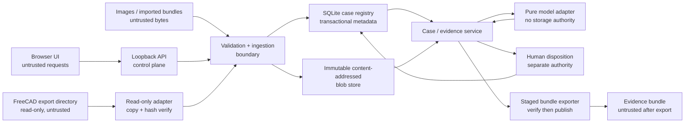
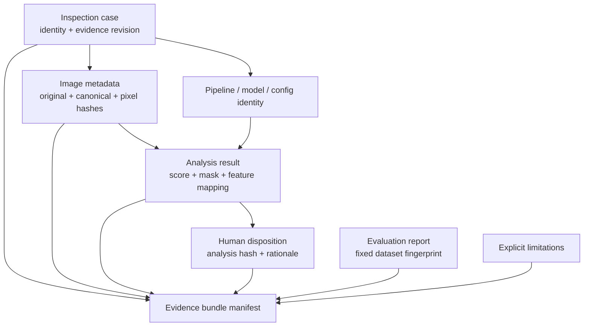

# System architecture

## Objective and boundary

Manufacturing Vision Studio links one inspected image to an immutable part and
CAD revision, produces reproducible anomaly evidence, records a separate human
disposition, and exports a verifiable evidence bundle. Synthetic fixtures are
the distributable demo. An optional FreeCAD Automation adapter consumes inert
exports in read-only mode.

Automated classification is evidence, never acceptance. Only a valid human
disposition can say `accept` or `reject`, and even that disposition means only a
demo review decision. It is not a production release, conformance certificate,
or safety approval.

## Components and trust boundaries



The boundaries are:

1. **Request boundary.** Browser fields, filenames, MIME declarations, paths,
   imported JSON, archives, and image bytes are untrusted. The API is bound to
   loopback by default and does not turn client strings into filesystem paths.
2. **Validation boundary.** Size checks, regular-file checks, magic-byte format
   detection, bounded decoding, JSON Schema validation, canonicalization, and
   digest verification happen before durable publication or model invocation.
3. **Model boundary.** The model receives validated decoded pixels and bounded
   feature regions. It cannot choose identity, read arbitrary paths, record a
   disposition, or publish evidence.
4. **Human boundary.** A human decision is an immutable document bound to the
   exact case revision, part identity, analysis hash, and inspection-image hash.
   Reviewer IDs are local labels, not authentication or digital signatures.
5. **Export boundary.** A bundle is assembled under a staging directory,
   verified as if imported from an untrusted source, and atomically renamed only
   after every invariant passes. Exported bundles are untrusted on re-import.
6. **FreeCAD boundary.** The adapter accepts only a strict manifest, JSON
   metadata, and PNG reference render. It never opens `.FCStd`/STEP files,
   executes macros, starts FreeCAD, follows symlinks, or writes to the source
   repository.

## Evidence lineage

The authoritative binding tuple is:

```text
case_id
+ case_revision
+ part_id
+ cad_revision
+ reference original/canonical/pixel SHA-256
+ inspection original/canonical/pixel SHA-256
+ pipeline_id + pipeline_version
+ model_id + model_version + model_artifact_sha256
+ configuration_sha256
```

The service, not a model or browser, copies that tuple into an analysis result.
A disposition adds `analysis_id` and the canonical analysis-result SHA-256. The
bundle manifest then binds the canonical case, image metadata, analysis,
disposition, evaluation report, masks, original images, and limitations by raw
artifact SHA-256.



The system MUST compare every repeated identity field. Repetition is deliberate:
it prevents an otherwise valid artifact from being attached to the wrong part,
revision, image, configuration, or analysis.

## Artifact contracts

| Document | Purpose | Key binding |
| --- | --- | --- |
| `inspection-case` | Current case and evidence-input selection | case, part/CAD identity, pipeline/model/config |
| `image-input-metadata` | Immutable validated source image | case, part/CAD identity, raw/canonical/pixel hashes |
| `analysis-result` | One reference/inspection model invocation | complete binding tuple and mask hash |
| `human-disposition` | Human review | case revision, part identity, analysis and image hashes |
| `evaluation-report` | Fixed-dataset performance and repeatability | dataset, pipeline/model/config hashes |
| `evidence-bundle-manifest` | Complete artifact inventory | case revision, part identity, every artifact hash |
| `freecad-export-adapter-manifest` | Read-only FreeCAD export description | upstream manifest hash, part/CAD identity, inert artifacts |

## Case lifecycle

The lifecycle is `draft -> ready -> analyzed -> disposed -> exported`. Failed
operations do not advance the state. `case_revision` is specifically the
evidence-input revision: it increments whenever part/CAD identity, image set,
feature map, pipeline/model selection, normalization policy, or configuration
changes. Status and timestamps are lifecycle metadata and do not redefine the
evidence tuple.

Changing any evidence input makes prior analyses and dispositions superseded;
they remain immutable audit evidence but cannot be used for a new disposition or
export. See [revision mismatch behavior](api-and-storage.md#revision-mismatch-is-fail-closed).

## Non-goals

- no camera control, PLC integration, production quality gate, or automated
  manufacturing release;
- no remote multi-user authentication or cryptographic reviewer signatures;
- no training pipeline or claim that the deterministic baseline generalizes to
  real factory images;
- no write-back to FreeCAD Automation or any sibling repository;
- no direct consumption of private or production data.
